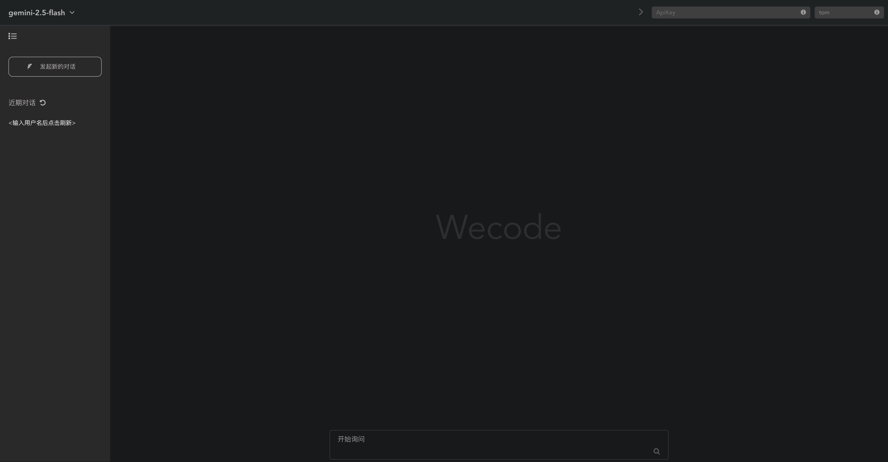
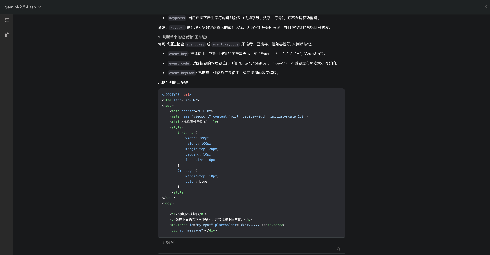

# Wecode Chat Web APP

## 背景

后端 Java 25 ，前端 Vue 3开发的轻量Web Chat应用，目前暂只支持Google Gemini API，后续会增加其他Chat API。

## 使用说明

1、下载代码后，先创建数据库，并运行script.sql脚本。

2、可直接使用IDEA打开项目，刷新maven下载依赖，修改数据库连接后即可启动项目。

3、前端依赖Nodejs环境，较新版即可，有了Node环境后，在前端目录`chatweb`中先执行`npm install`安装依赖，然后再执行`npm run serve`启动前端项目。

4、后端接口8000，前端8080，前后都启动后浏览器输入`http://localhost:8080`回车即可。

